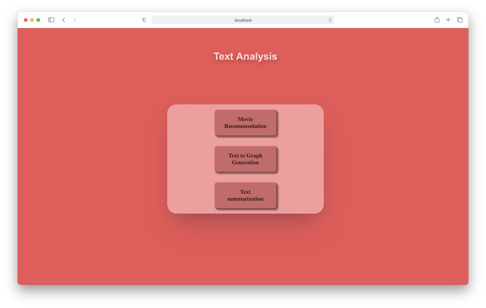

<h1>Text Analysis &nbsp;   &nbsp; </h1>

---

A Web-Application to demonstrate, Text analysis on Movie Recommendation, Text to Graph and Text Summarization.

#### Note

> This project was developed as my internship project. <br>
> My intention was to make an interactable webpage through which Text Analysis goodies can be demonstrated. <br>

### Preview



### Installation
> Download __[Glove 6B](https://nlp.stanford.edu/data/glove.6B.zip)__ data and place it in this file structure.
```
|--data
   |--glove.6B
      |--glove.6B.100d.txt
```

```
$ pip install requirements.txt
```

#### To clone this repository

> `git clone https://github.com/reach-the-sky/Text-Analysis.git`

<b>If you liked my project and appreciate the content I opensource, consider following me on [Github 🌥](https://github.com/reach-the-sky).</b>
